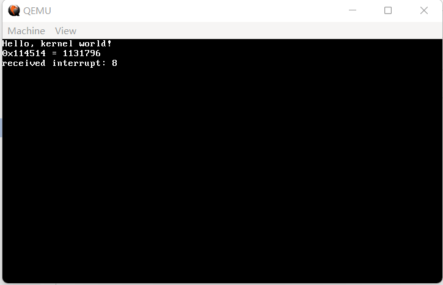
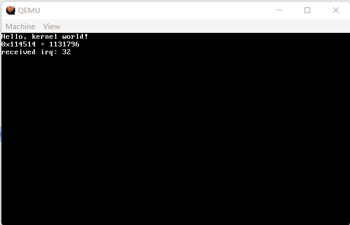
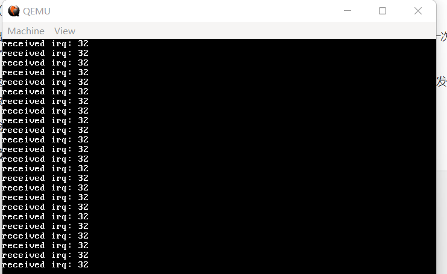
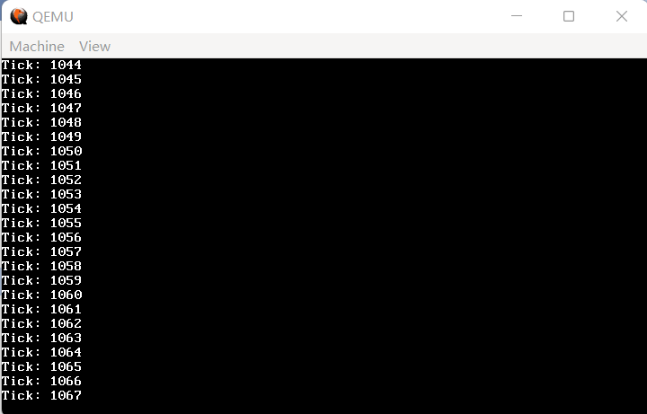

第9节中，我们设置的异常是一种内部的中断。而本节，我们将要接收来自外部设备的中断。

话说回来，我们前面一直提到中断，到底什么是中断？字面意思上讲，就是你正在持续的工作被突然打断。发挥联想记忆，可以知道，中断实际上就是在操作系统正常运行的过程中，让它被迫接收的信号。

与现实生活中的中断不同，操作系统中，中断是操作系统**最本质的驱动力**，如果没有中断，一切都会非常复杂，CPU将花费大量的时间查询设备状态；而现在，不同的硬件会发不同的中断信号，在接收的过程中慢慢处理即可。

扯得有点多，往回收收。由于0-31号IDT已经归给了异常，现在又有16个外设中断信号，那么最自然的想法，就是把它们放置在32-47号IDT。

什么？你说电脑明明有一堆外设，中断号为什么这么少？仔细想想就会发现，如果所有的外设都给CPU发中断，那CPU不仅分辨不出来谁是谁，更是要炸了。因此，在x86框架下，所有的中断会被汇集到一个叫做8259A的芯片，它还有另一个名字，叫做**可编程中断控制器**（PIC），当然，目前已经被淘汰了。实际操作中，由PIC分辨每一个外设，并发送两个字节（0xCD 外设编号）给CPU，从而使得CPU自动执行对应外设的中断处理程序。

好了，原理大致如此，我们开始。这么一看，中断处理和IDT也脱不了干系，先对16个外设中断信号对应的IDT进行设置，请添加在 `idt_flush` 之前：

**代码 10-1 设置外设中断信号对应的中断描述符（kernel/gdtidt.c）**
```c
    idt_set_gate(32, (uint32_t) irq0, 0x08, 0x8E);
    idt_set_gate(33, (uint32_t) irq1, 0x08, 0x8E);
    idt_set_gate(34, (uint32_t) irq2, 0x08, 0x8E);
    idt_set_gate(35, (uint32_t) irq3, 0x08, 0x8E);
    idt_set_gate(36, (uint32_t) irq4, 0x08, 0x8E);
    idt_set_gate(37, (uint32_t) irq5, 0x08, 0x8E);
    idt_set_gate(38, (uint32_t) irq6, 0x08, 0x8E);
    idt_set_gate(39, (uint32_t) irq7, 0x08, 0x8E);
    idt_set_gate(40, (uint32_t) irq8, 0x08, 0x8E);
    idt_set_gate(41, (uint32_t) irq9, 0x08, 0x8E);
    idt_set_gate(42, (uint32_t) irq10, 0x08, 0x8E);
    idt_set_gate(43, (uint32_t) irq11, 0x08, 0x8E);
    idt_set_gate(44, (uint32_t) irq12, 0x08, 0x8E);
    idt_set_gate(45, (uint32_t) irq13, 0x08, 0x8E);
    idt_set_gate(46, (uint32_t) irq14, 0x08, 0x8E);
    idt_set_gate(47, (uint32_t) irq15, 0x08, 0x8E);
```

（这一部分直接放在末尾即可）

**代码 10-2 16个外设中断信号的声明（kernel/gdtidt.h）**
```c
extern void irq0();
extern void irq1();
extern void irq2();
extern void irq3();
extern void irq4();
extern void irq5();
extern void irq6();
extern void irq7();
extern void irq8();
extern void irq9();
extern void irq10();
extern void irq11();
extern void irq12();
extern void irq13();
extern void irq14();
extern void irq15();
```

`interrupt.asm` 中的代码几乎与异常时如出一辙：

**代码 10-3 外设中断信号的实现（kernel/interrupt.asm）**
```c
%macro IRQ 2
global irq%1
irq%1:
    cli
    push byte 0
    push %2
    jmp irq_common_stub
%endmacro

IRQ 0, 32
IRQ 1, 33
IRQ 2, 34
IRQ 3, 35
IRQ 4, 36
IRQ 5, 37
IRQ 6, 38
IRQ 7, 39
IRQ 8, 40
IRQ 9, 41
IRQ 10, 42
IRQ 11, 43
IRQ 12, 44
IRQ 13, 45
IRQ 14, 46
IRQ 15, 47

[extern irq_handler]
; 通用中断处理程序
irq_common_stub:
    pusha ; 存储所有寄存器

    mov ax, ds
    push eax ; 存储ds

    mov ax, 0x10 ; 将内核数据段赋值给各段
    mov ds, ax
    mov es, ax
    mov fs, ax
    mov gs, ax

    call irq_handler ; 调用C语言处理函数

    pop eax ; 恢复各段
    mov ds, ax
    mov es, ax
    mov fs, ax
    mov gs, ax

    popa ; 弹出所有寄存器

    add esp, 8 ; 弹出错误码和中断ID
    iret ; 从中断返回
```

只是调用的参数换了个名字。最后是 `irq_handler`：

**代码 10-4 中断处理程序的C语言接口（kernel/isr.c）**
```c
void irq_handler(registers_t regs)
{
    monitor_write("received irq: ");
    monitor_write_dec(regs.int_no);
    monitor_put('\n');
}
```

甚至完全一致，除了删掉了关闭中断和无限悬停的部分。

最后，由于 `kernel.asm` 中关闭了外部中断，在此处需要重新打开。因此，需要在 `main.c` 中把上一节测试用的 `asm("ud2");` 替换为 `asm("sti");`。

完整 `main.c` 如下：

**代码 10-5 测试用（kernel/main.c）**
```c
#include "monitor.h"
#include "gdtidt.h"
 
void kernel_main() // kernel.asm会跳转到这里
{
    init_gdtidt();
    monitor_clear(); // 先清屏
    monitor_write("Hello, kernel world!\n");
    // 验证write_hex和write_dec，由于没有printf，这一步十分烦人
    monitor_write_hex(0x114514);
    monitor_write(" = ");
    monitor_write_dec(0x114514);
    monitor_write("\n");
    asm("sti");
 
    // 悬停
    while (1);
}
```

编译，运行，效果如图：


（图 10-1 运行失败）

嗯？8号中断？这不是异常吗？这是怎么回事？？

我当初做到这里的时候，一度怀疑人生，在代码中查询到底是哪里出了问题，最终没有结果（笑）。后来查阅资料发现，8号异常不会随便出现，当CPU找不到对应异常的处理程序，但是有8号异常处理程序时，才会调用8号异常处理程序（顺便说一下，如果没有8号处理程序，结果自然就是重启啦）。最终我才得以确定，程序本身并没有问题。

那么，这个神秘的8号异常是哪里来的呢？

解铃还须系铃人。我们鼓捣了半天，偏偏把最重要的 PIC 给忘了！而16位模式下，PIC默认时钟中断为8号外设，由于我们没管PIC，所以它还是16位的状态，此时出现了时钟中断，PIC自然就会给CPU发送8号中断！

重设PIC也是非常古老、非常屎山也是非常定式的操作，由于涉及到硬件，这里不多解说。总之只要添加这8行代码，就没有问题（把它们添加在 `init_idt` 中的 `memset` 之前）：

**代码 10-6 重设PIC（kernel/gdtidt.c）**
```c
// 初始化PIC
    outb(0x20, 0x11);
    outb(0xA0, 0x11);
    outb(0x21, 0x20);
    outb(0xA1, 0x28);
    outb(0x21, 0x04);
    outb(0xA1, 0x02);
    outb(0x21, 0x01);
    outb(0xA1, 0x01);
    outb(0x21, 0x0);
    outb(0xA1, 0x0);
```

老样子，编译运行，效果如图：


（图 10-2 成功一半）

出现了 `received irq: 32`，说明我们重设PIC成功了，耶！但是仔细一想，谁家时钟只会滴答一次？那么为什么我们的时钟中断只发了一次就没有了？

这是因为，PIC非常忙，不止有这一个外设要管，鬼知道你这边完事没有。因此，我们需要向PIC发信号说“处理完毕啦”，这个信号被称作EOI。

我们在 `irq_handler` 中加入EOI的发送：

**代码 10-7 发送EOI（kernel/isr.c）**
```c
void irq_handler(registers_t regs)
{
    if (regs.int_no >= 0x28) outb(0xA0, 0x20); // 给从片发EOI
    outb(0x20, 0x20); // 给主片发EOI
    monitor_write("received irq: ");
    monitor_write_dec(regs.int_no);
    monitor_put('\n');
}
```

这里的从片主片又是什么东西呢？虽然总共有16个外设信号，但是一个PIC总共只有8条向外输出的线，只好搞两个PIC，一主一从，两个PIC通过两个外设中断互相交换信息。所以，其实有两个外设中断是没有用的。

这下总行了吧？编译，运行，效果如图：



（图 10-3 成功）

至此，我们成功实现了对 IRQ 的接收。不过，我们对外设中断的要求更苛刻一点——能不能让接收方自己决定怎么处置外设中断呢？

这一部分完全在软件层级，可以用 C 语言来完成。

首先，定义自定义中断处理程序函数：

**代码 10-8 开始自定义中断处理程序（kernel/isr.h）**
```c
#define IRQ0 32
#define IRQ1 33
#define IRQ2 34
#define IRQ3 35
#define IRQ4 36
#define IRQ5 37
#define IRQ6 38
#define IRQ7 39
#define IRQ8 40
#define IRQ9 41
#define IRQ10 42
#define IRQ11 43
#define IRQ12 44
#define IRQ13 45
#define IRQ14 46
#define IRQ15 47

typedef void (*isr_t)(registers_t *);
void register_interrupt_handler(uint8_t n, isr_t handler);
```

下面已经添加了注册函数了，在 `isr.c` 中加入一行：

**代码 10-9 自定义中断处理程序列表（kernel/isr.c）**
```c
static isr_t interrupt_handlers[256];
```

由于 `isr_t` 是函数指针，因此可以用是否为 NULL 判断是否存在自定义中断处理程序。这是新版的 `irq_handler`：

**代码 10-10 将中断信号分发给自定义处理程序，以及注册函数（kernel/isr.c）**
```c
void irq_handler(registers_t regs)
{
    if (regs.int_no >= 0x28) outb(0xA0, 0x20); // 中断号 >= 40，来自从片，发送EOI给从片
    outb(0x20, 0x20); // 发送EOI给主片

    if (interrupt_handlers[regs.int_no])
    {
        isr_t handler = interrupt_handlers[regs.int_no]; // 有自定义处理程序，调用之
        handler(&regs); // 传入寄存器
    }
}

void register_interrupt_handler(uint8_t n, isr_t handler)
{
    interrupt_handlers[n] = handler;
}
```

为避免 `regs` 在传值中出现不必要的拷贝，这里选择使用指针形式对自定义中断处理程序进行传入。

现在再编译运行，应该恢复到图 8-6 的状态了，一片祥和。

那么，接下来就是暴风雨了，我们来自定义一个时钟中断处理程序。

首先，对于时钟中断目前的频率，我们只知道 PIT 内部的时钟频率为 1193180 Hz（什么b数），对于具体的频率，我们是一无所知的。不过，这个值可以更改，具体方法为：

1) 用 1193180 Hz 除以希望每多少毫秒给一个时钟中断的数值，记为 x；

2) 向 0x43 端口（时钟 Command 寄存器）发送 0x36（设置频率）指令；

3) 分两次向 0x40 端口（时钟 Counter 0 寄存器，管理和计数相关的东西）分别发送 x 的低8位和高8位。

上述逻辑并不复杂。为了管理时钟，我们新建一个 `timer.c`，其具体代码依照上面逻辑可如下写出：

**代码 10-11 时钟管理程序（kernel/timer.c）**
```c
#include "timer.h"
#include "isr.h"
#include "monitor.h"

uint32_t tick = 0; // 这里做一下记录，不过也没什么用？

static void timer_callback(registers_t *regs)
{
    tick++;
    monitor_write("Tick: ");
    monitor_write_dec(tick);
    monitor_put('\n'); // 测试用，暂时打印一下ticks
}

void init_timer(uint32_t freq)
{
    register_interrupt_handler(IRQ0, &timer_callback); // 将时钟中断处理程序注册给IRQ框架

    uint32_t divisor = 1193180 / freq;

    outb(0x43, 0x36); // 指令位，写入频率

    uint8_t l = (uint8_t) (divisor & 0xFF); // 低8位
    uint8_t h = (uint8_t) ((divisor >> 8) & 0xFF); // 高8位

    outb(0x40, l);
    outb(0x40, h); // 分两次发出
}
```

**代码 10-12 声明（include/timer.h）**
```c
#ifndef _TIMER_H_
#define _TIMER_H_

#include "common.h"

void init_timer(uint32_t freq);

#endif
```

我们不仅增加了 `init_timer`，而且还注册了时钟中断的处理函数。目前它只是打印一下当前的ticks，后面会对它进行更改。

最后，在 `kernel_main` 中加入一行 `init_timer(50);`，在 `Makefile` 的 `OBJS` 变量后面追加 `timer.o`，编译，运行，效果如图：



（图 10-4 自定义时钟中断处理程序）

我们看到了不断增加的 `ticks`，这是一个极好的现象，说明我们对时钟的设置和对 IRQ 自定义处理程序的设置都成功了。
