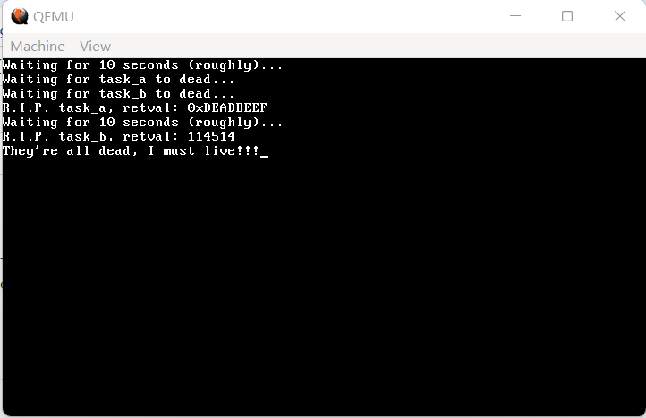
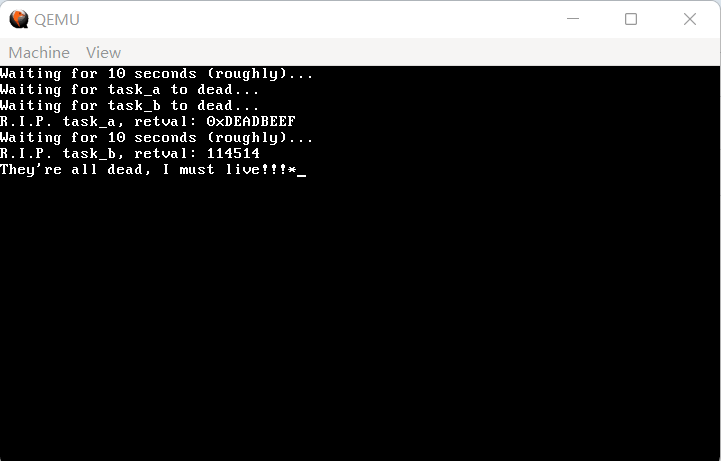
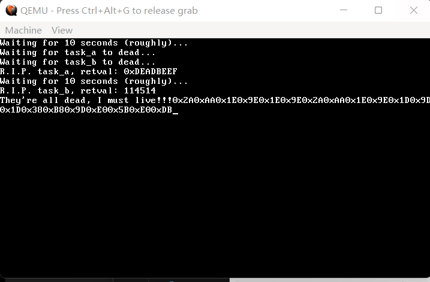
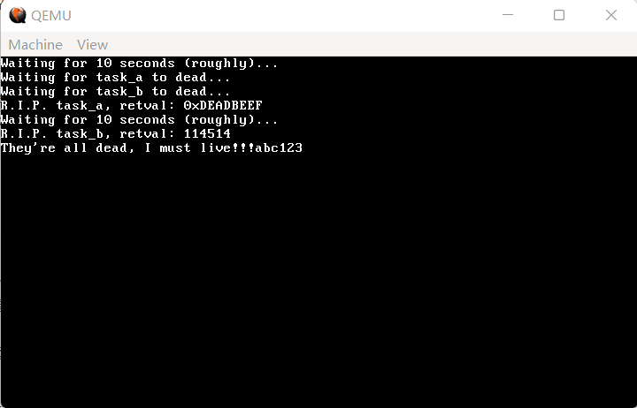

如果没有键盘，这篇文章大概是写不出来的，由此就可以看出键盘对于人机交互的重要影响。

首先是一个好消息，键盘在 PIC 里是有外设编号的（希望大家还记得 PIC，否则建议复习第10节），按我们的设定，编号为 33。并不是所有的外设都在 PIC 里自带编号，像网卡啊、声卡这些，都是没有自带编号的。

那么既然如此，新建 `drivers/keyboard.c`，我们来写一个最简单的键盘驱动：

**代码 13-1 最简单的键盘驱动（drivers/keyboard.c）**
```c
#include "isr.h"
#include "keyboard.h"

void keyboard_handler(registers_t *regs)
{
    monitor_write("*");
}

void init_keyboard()
{
    register_interrupt_handler(IRQ1, keyboard_handler);
}
```

**代码 13-2 声明（include/keyboard.h）**
```c
#ifndef _KEYBOARD_H_
#define _KEYBOARD_H_

void init_keyboard();

#endif
```

添加了新目录，照例放一下 Makefile：

**代码 13-3 如今的 Makefile（Makefile）**
```plain
OBJS = out/kernel.o out/common.o out/monitor.o out/main.o out/gdtidt.o out/nasmfunc.o out/isr.o out/interrupt.o \
	 out/string.o out/timer.o out/memory.o out/mtask.o out/keyboard.o

out/%.o : kernel/%.c
	i686-elf-gcc -c -I include -O0 -fno-builtin -fno-stack-protector -o out/$*.o kernel/$*.c

out/%.o : kernel/%.asm
	nasm -f elf -o out/$*.o kernel/$*.asm

out/%.o : lib/%.c
	i686-elf-gcc -c -I include -O0 -fno-builtin -fno-stack-protector -o out/$*.o lib/$*.c

out/%.o : lib/%.asm
	nasm -f elf -o out/$*.o lib/$*.asm

out/%.o : drivers/%.c
	i686-elf-gcc -c -I include -O0 -fno-builtin -fno-stack-protector -o out/$*.o drivers/$*.c

out/%.o : drivers/%.asm
	nasm -f elf -o out/$*.o drivers/$*.asm

out/%.bin : boot/%.asm
	nasm -I boot/include -o out/$*.bin boot/$*.asm

out/kernel.bin : $(OBJS)
	i686-elf-ld -s -Ttext 0x100000 -o out/kernel.bin $(OBJS)

a.img : out/boot.bin out/loader.bin out/kernel.bin
	dd if=out/boot.bin of=a.img bs=512 count=1
	edimg imgin:a.img copy from:out/loader.bin to:@: copy from:out/kernel.bin to:@: imgout:a.img

run : a.img
	qemu-system-i386 -fda a.img

```

编译，运行，效果如下两图：


（图 13-1 按下第一个按键前）



（图 13-2 按下第一个按键后）

按下第一个按键后，出现了一个 `*`，这是非常好的现象。但是，我们发现，后续无论再怎么按键，都完全没有任何作用，屏幕上不再有新的星号出现。

这是为什么呢？查阅资料我们发现，这是键盘控制器（8042、8048）干的好事。当按键被按下时，键盘处理器将根据对应的键产生一个或多个对应的代码，我们称之为**扫描码**，这个或这些扫描码随即被依次写入到键盘控制器自带的缓冲区中。在写入完后，键盘控制器会立即发送一个中断信号。然而，如果内核在收到中断后不读出这个缓冲区里的扫描码，键盘就会卡死。

键盘控制器的缓冲区端口号为 `0x60`，我们只需要用 `inb(0x60)` 就可以读出键盘缓冲区中的扫描码。因此，修改 `keyboard_handler`，我们来看看读出的扫描码长什么样：

**代码 13-4 新版键盘驱动（drivers/keyboard.c）**
```c
#include "isr.h"
#include "keyboard.h"
 
void keyboard_handler(registers_t *regs)
{
    monitor_write_hex(inb(0x60)); // 打印读出的扫描码
}
 
void init_keyboard()
{
    register_interrupt_handler(IRQ1, keyboard_handler);
}
```

编译，运行，等待约半分钟后，效果如下：



（图 13-3 运行效果）

在本图中，依次按下了shift、a、a、shift、a、lctrl、lctrl、alt、win这几个键。我们发现，虽然一共只按了9个键，但产生了20个扫描码。这是因为，扫描码不是单独出现，而是成对出现的，按下时产生一组，松开时产生一组。

那么，我们怎么知道每个按键对应的是哪个扫描码呢？一个可实践的方法是，按照上面的顺序依次分别按下，观察屏幕上扫描码的变化。不过，这对写代码解析扫描码是没有帮助的。

还有另外一个办法，就是依次按下键盘上的每一个键，看看它对应的扫描码，然后记录到一个数组或者其他什么地方。不过，这样做实在太过耗时，前人栽树，后人乘凉，我们选择直接把这个数组抄下来：

**代码 13-5 从扫描码到每一个键的对应关系（drivers/keymap.c）**
```c
#include "keyboard.h"
#include "common.h"

uint32_t keymap[NR_SCAN_CODES * MAP_COLS] = {
    0,            0,           0,
    ESC,          ESC,         0,
    '1',          '!',         0,
    '2',          '@',         0,
    '3',          '#',         0,
    '4',          '$',         0,
    '5',          '%',         0,
    '6',          '^',         0,
    '7',          '&',         0,
    '8',          '*',         0,
    '9',          '(',         0,
    '0',          ')',         0,
    '-',          '_',         0,
    '=',          '+',         0,
    BACKSPACE,    BACKSPACE,   0,
    TAB,          TAB,         0,
    'q',          'Q',         0,
    'w',          'W',         0,
    'e',          'E',         0,
    'r',          'R',         0,
    't',          'T',         0,
    'y',          'Y',         0,
    'u',          'U',         0,
    'i',          'I',         0,
    'o',          'O',         0,
    'p',          'P',         0,
    '[',          '{',         0,
    ']',          '}',         0,
    ENTER,        ENTER,       PAD_ENTER,
    CTRL_L,       CTRL_L,      CTRL_R,
    'a',          'A',         0,
    's',          'S',         0,
    'd',          'D',         0,
    'f',          'F',         0,
    'g',          'G',         0,
    'h',          'H',         0,
    'j',          'J',         0,
    'k',          'K',         0,
    'l',          'L',         0,
    ';',          ':',         0,
    '\'',         '"',         0,
    '`',          '~',         0,
    SHIFT_L,      SHIFT_L,     0,
    '\\',         '|',         0,
    'z',          'Z',         0,
    'x',          'X',         0,
    'c',          'C',         0,
    'v',          'V',         0,
    'b',          'B',         0,
    'n',          'N',         0,
    'm',          'M',         0,
    ',',          '<',         0,
    '.',          '>',         0,
    '/',          '?',         PAD_SLASH,
    SHIFT_R,      SHIFT_R,     0,
    '*',          '*',         0,
    ALT_L,        ALT_L,       ALT_R,
    ' ',          ' ',         0,
    CAPS_LOCK,    CAPS_LOCK,   0,
    F1,           F1,          0,
    F2,           F2,          0,
    F3,           F3,          0,
    F4,           F4,          0,
    F5,           F5,          0,
    F6,           F6,          0,
    F7,           F7,          0,
    F8,           F8,          0,
    F9,           F9,          0,
    F10,          F10,         0,
    NUM_LOCK,     NUM_LOCK,    0,
    SCROLL_LOCK,  SCROLL_LOCK, 0,
    PAD_HOME,     '7',         HOME,
    PAD_UP,       '8',         UP,
    PAD_PAGEUP,   '9',         PAGEUP,
    PAD_MINUS,    '-',         0,
    PAD_LEFT,     '4',         LEFT,
    PAD_MID,      '5',         0,
    PAD_RIGHT,    '6',         RIGHT,
    PAD_PLUS,     '+',         0,
    PAD_END,      '1',         END,
    PAD_DOWN,     '2',         DOWN,
    PAD_PAGEDOWN, '3',         PAGEDOWN,
    PAD_INS,      '0',         INSERT,
    PAD_DOT,      '.',         DELETE,
    0,            0,           0,
    0,            0,           0,
    0,            0,           0,
    F11,          F11,         0,
    F12,          F12,         0,
    0,            0,           0,
    0,            0,           0,
    0,            0,           GUI_L,
    0,            0,           GUI_R,
    0,            0,           APPS,
    0,            0,           0
};
```

`keymap` 数组中的第一列代表正常按下对应的键，第二列代表按 `shift` 时对应的键，第三列代表同样的扫描码前面跟着 `0xE0` 时候对应的键。后续的解析中，这一段是有大用处的。

这一段数组中出现了非常多的宏，诸如 `NR_SCAN_CODES`、`MAP_COLS`、`ESC` 等等。数组中的宏是每一个键的唯一标识，在保证唯一性的情况下，读者可以任意指定；而剩下的 `NR_SCAN_CODES` 和 `MAP_COLS` 则分别为 `0x7f` 和 `3`。需要注意的是，`keymap` 里的索引是按下时的扫描码，而非抬起时的扫描码，实际编程时需要留意一下。

在本教程中使用的一个 `keyboard.h` 的示例如下：

**代码 13-6 各种宏的统一声明（include/keyboard.h）**
```c
#ifndef _KEYBOARD_H_
#define _KEYBOARD_H_

void init_keyboard();

#define NR_SCAN_CODES 0x80
#define MAP_COLS      3

#define FLAG_BREAK    0x0080
#define FLAG_EXT      0x0100
#define FLAG_SHIFT_L  0x0200
#define FLAG_SHIFT_R  0x0400
#define FLAG_CTRL_L   0x0800
#define FLAG_CTRL_R   0x1000
#define FLAG_ALT_L    0x2000
#define FLAG_ALT_R    0x4000
#define FLAG_PAD      0x8000

#define MASK_RAW      0x1ff

#define ESC           (0x01 + FLAG_EXT)
#define TAB           (0x02 + FLAG_EXT)
#define ENTER         (0x03 + FLAG_EXT)
#define BACKSPACE     (0x04 + FLAG_EXT)

#define GUI_L         (0x05 + FLAG_EXT)
#define GUI_R         (0x06 + FLAG_EXT)
#define APPS          (0x07 + FLAG_EXT)

#define SHIFT_L       (0x08 + FLAG_EXT)
#define SHIFT_R       (0x09 + FLAG_EXT)
#define CTRL_L        (0x0A + FLAG_EXT)
#define CTRL_R        (0x0B + FLAG_EXT)
#define ALT_L         (0x0C + FLAG_EXT)
#define ALT_R         (0x0D + FLAG_EXT)

#define CAPS_LOCK     (0x0E + FLAG_EXT)
#define NUM_LOCK      (0x0F + FLAG_EXT)
#define SCROLL_LOCK   (0x10 + FLAG_EXT)

#define F1            (0x11 + FLAG_EXT)
#define F2            (0x12 + FLAG_EXT)
#define F3            (0x13 + FLAG_EXT)
#define F4            (0x14 + FLAG_EXT)
#define F5            (0x15 + FLAG_EXT)
#define F6            (0x16 + FLAG_EXT)
#define F7            (0x17 + FLAG_EXT)
#define F8            (0x18 + FLAG_EXT)
#define F9            (0x19 + FLAG_EXT)
#define F10           (0x1A + FLAG_EXT)
#define F11           (0x1B + FLAG_EXT)
#define F12           (0x1C + FLAG_EXT)

#define PRINTSCREEN   (0x1D + FLAG_EXT)
#define PAUSEBREAK    (0x1E + FLAG_EXT)
#define INSERT        (0x1F + FLAG_EXT)
#define DELETE        (0x20 + FLAG_EXT)
#define HOME          (0x21 + FLAG_EXT)
#define END           (0x22 + FLAG_EXT)
#define PAGEUP        (0x23 + FLAG_EXT)
#define PAGEDOWN      (0x24 + FLAG_EXT)
#define UP            (0x25 + FLAG_EXT)
#define DOWN          (0x26 + FLAG_EXT)
#define LEFT          (0x27 + FLAG_EXT)
#define RIGHT         (0x28 + FLAG_EXT)

#define POWER         (0x29 + FLAG_EXT)
#define SLEEP         (0x2A + FLAG_EXT)
#define WAKE          (0x2B + FLAG_EXT)

#define PAD_SLASH     (0x2C + FLAG_EXT)
#define PAD_STAR      (0x2D + FLAG_EXT)
#define PAD_MINUS     (0x2E + FLAG_EXT)
#define PAD_PLUS      (0x2F + FLAG_EXT)
#define PAD_ENTER     (0x30 + FLAG_EXT)
#define PAD_DOT       (0x31 + FLAG_EXT)
#define PAD_0         (0x32 + FLAG_EXT)
#define PAD_1         (0x33 + FLAG_EXT)
#define PAD_2         (0x34 + FLAG_EXT)
#define PAD_3         (0x35 + FLAG_EXT)
#define PAD_4         (0x36 + FLAG_EXT)
#define PAD_5         (0x37 + FLAG_EXT)
#define PAD_6         (0x38 + FLAG_EXT)
#define PAD_7         (0x39 + FLAG_EXT)
#define PAD_8         (0x3A + FLAG_EXT)
#define PAD_9         (0x3B + FLAG_EXT)

#define PAD_UP        PAD_8
#define PAD_DOWN      PAD_2
#define PAD_LEFT      PAD_4
#define PAD_RIGHT     PAD_6
#define PAD_HOME      PAD_7
#define PAD_END       PAD_1
#define PAD_PAGEUP    PAD_9
#define PAD_PAGEDOWN  PAD_3
#define PAD_INS       PAD_0
#define PAD_MID       PAD_5
#define PAD_DEL       PAD_DOT

#define KB_DATA  0x60
#define KB_CMD   0x64
#define LED_CODE 0xED
#define KB_ACK   0xFA

#endif
```

这里给所有在 `keymap` 数组中用到的宏统一加了 `FLAG_EXT`，这是为了后期处理时可以分辨可打印的字符对应的键（如asdf）与不可打印的字符对应的键（如F11、F12）。

在 `Makefile` 的 `OBJS` 中追加一个 `keymap.o`，由于我们尚未开始解析扫描码，所以这一部分没有变化。

接下来，为了存储获得到的扫描码，我们来做一个存储扫描码用的数据结构。显然，先按下的键需要先被处理，所以我们选择做一个队列。

基本数据结构相关的代码就不解说了，下面是一个没那么经典的环形队列的实现：

**代码 13-7 FIFO队列的实现（lib/fifo.c）**
```c
#include "fifo.h"

void fifo_init(fifo_t *fifo, int size, uint32_t *buf)
{
    fifo->size = size;
    fifo->buf = buf;
    fifo->free = size;
    fifo->flags = 0;
    fifo->p = 0;
    fifo->q = 0;
}

int fifo_put(fifo_t *fifo, uint32_t data)
{
    if (fifo->free == 0) {
        fifo->flags |= FIFO_FLAGS_OVERRUN;
        return -1;
    }
    fifo->buf[fifo->p] = data;
    fifo->p++;
    if (fifo->p == fifo->size) fifo->p = 0;
    fifo->free--;
    return 0;
}

int fifo_get(fifo_t *fifo)
{
    int data;
    if (fifo->free == fifo->size) return -1;
    data = fifo->buf[fifo->q];
    fifo->q++;
    if (fifo->q == fifo->size) fifo->q = 0;
    fifo->free++;
    return data;
}

int fifo_status(fifo_t *fifo)
{
    return fifo->size - fifo->free;
}
```

**代码 13-8 声明（include/fifo.h）**
```c
#ifndef _FIFO_H_
#define _FIFO_H_

#include "common.h"

typedef struct FIFO {
    uint32_t *buf;
    int p, q, size, free, flags;
} fifo_t;

#define FIFO_FLAGS_OVERRUN 1

void fifo_init(fifo_t *fifo, int size, uint32_t *buf);
int fifo_put(fifo_t *fifo, uint32_t data);
int fifo_get(fifo_t *fifo);
int fifo_status(fifo_t *fifo);

#endif
```

在 `Makefile` 的 `OBJS` 中追加 `out/fifo.o`，编译运行，效果仍应不变，因为这个队列我们也还没开始用。

具体实践中如何使用这样一个队列呢？我们先来到 `keyboard.c`，创建一个存储扫描码用的 `keyfifo`：

**代码 13-9 创建 `keyfifo`（drivers/keyboard.c）**
```c
#include "isr.h"
#include "keyboard.h"
#include "fifo.h"

fifo_t keyfifo;
uint32_t keybuf[32];
extern uint32_t keymap[];

void keyboard_handler(registers_t *regs)
{
    monitor_write_hex(inb(0x60));
}
 
void init_keyboard()
{
    fifo_init(&keyfifo, 32, keybuf);
    register_interrupt_handler(IRQ1, keyboard_handler);
}
```

然后在 `keyboard_handler` 中，我们存储扫描码到 `keyfifo`：

**代码 13-10 存入扫描码（drivers/keyboard.c）**
```c
static uint8_t get_scancode()
{
    uint8_t scancode;
    asm("cli");
    scancode = fifo_get(&keyfifo);
    asm("sti");
    return scancode;
}

static void keyboard_read()
{
    if (fifo_status(&keyfifo) > 0) {
        uint8_t scancode = get_scancode();
        monitor_write_hex(scancode);
    }
}

void keyboard_handler(registers_t *regs)
{
    fifo_put(&keyfifo, inb(KB_DATA));
    keyboard_read();
}
```

我们同时还新建了 `keyboard_read` 和 `get_scancode` 两个函数，未来我们对键盘数据的处理将主要在 `keyboard_read` 当中进行。

编译，运行，效果仍应不变，因为我们还没有开始处理扫描码。事不过三，我们马上就开始处理工作。

**代码 13-11 初步处理扫描码（drivers/keyboard.c）**
```c
static void keyboard_read()
{
    uint8_t scancode;
    int make;
    if (fifo_status(&keyfifo) > 0) {
        scancode = get_scancode();
        if (scancode == 0xE1) {
            // 特殊开头，暂不做处理
        } else if (scancode == 0xE0) {
            // 特殊开头，暂不做处理
        } else {
            make = (scancode & FLAG_BREAK ? true : false);
            if (make) {
                char key = keymap[(scancode & 0x7f) * MAP_COLS];
                monitor_put(key);
            }
        }
    }
}
```

`FLAG_BREAK` 在之前的 `keyboard.h` 中已有定义，是 `0x80`。在之前的现象图中观察发现，除了win键以外，每次按下的扫描码比抬起的扫描码少 `0x80`。因此只需要探测 `0x80` 是否存在，就可以确定现在的这个键是被按下还是被抬起，选择一个处理即可。

这就是 `else` 中第一行的作用，这里选择的是被抬起时进行判断。`scancode & 0x7f` 可以取得对应的被按下时的扫描码，从而作为 `keymap` 的索引获得对应的键。

好了，现在编译运行，等待 `task_c` 输出完成后，输入 `abc123`，效果如下：



（图 13-4 成功输出）

我们看到了后面的 `abc123`，说明我们的键盘驱动已经初步完成。本节的篇幅已经够长了，下一节我们将继续写键盘驱动，做出一个基本的处理框架。
