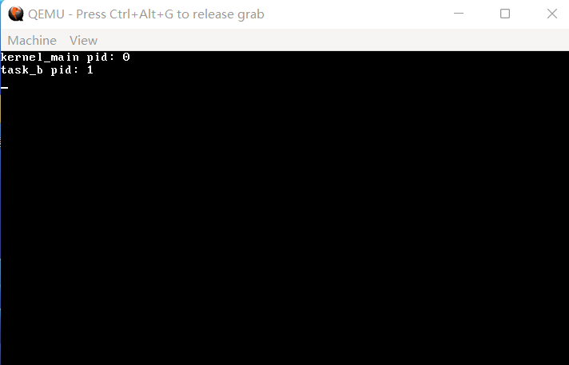

如果你没用过 Linux，只做过 Windows 开发，那么没听说过系统调用（或者其简称syscall）是比较正常的，但没听说过API是不太合理的。在本篇文章中，你可以暂时认为这两者是一样的。

如果你做过 32 位的 Linux 开发，那就比较好说了，如果没有做过也无所谓。

首先，我们得想一想：程序是如何调用系统的功能的呢？在 C 语言中，或许只是一个函数调用，那么在底层，它长什么样呢？

在 32 位的 Linux 中，它的底层是这样的：往 eax、ebx 这些寄存器里填好参数，然后执行 `int 80h`。这看起来很好用，我们也来抄一下。

首先，我们来在 IDT 里创建一个 `0x80` 编号的中断描述符。

**代码 15-1 `0x80` 号中断描述符（kernel/gdtidt.c）**
```c
    idt_set_gate(47, (uint32_t) irq15, 0x08, 0x8E);

    idt_set_gate(0x80, (uint32_t) syscall_handler, 0x08, 0x8E | 0x60); // 这里是新增的

    idt_flush((uint32_t) &idt_ptr);
```

**代码 15-2 开头声明（kernel/gdtidt.c）**
```c
extern void gdt_flush(uint32_t);
extern void idt_flush(uint32_t);
extern void syscall_handler(); // 这里是新增的
```

和上面设置第 15 号中断的代码相对比，我们发现在最后一个参数处有些奇怪，为什么要 `| 0x60` 呢？事实上，`| 0x60` 的意思就是说，这个中断是给应用程序用的。可是我们目前还没有应用程序，因此只能让操作系统代为测试了。

接下来我们来编写 `syscall_handler`：

**代码 15-3 系统调用入口（kernel/interrupt.asm）**
```asm
[extern syscall_manager]
[global syscall_handler]
syscall_handler:
    sti ; CPU 在执行 int 指令时默认关闭中断，我们只是来用一下系统功能，所以把中断打开
    pushad ; 用于返回值的 pushad
    pushad ; 用于给 syscall_manager 传值的 pushad

    call syscall_manager

    add esp, 32 ; 把给syscall_manager 传值的 pushad 部分跳过
    popad ; 把希望系统调用后的寄存器情况 pop 出来
    iretd ; 由于是 int 指令，所以用 iretd 返回
```

接着，在 kernel 目录下创建 `syscall.c`，我们来实现 `syscall_manager`：

**代码 15-4 系统调用分发（kernel/syscall.c）**
```c
#include "common.h"
#include "syscall.h"

void syscall_manager(int edi, int esi, int ebp, int esp, int ebx, int edx, int ecx, int eax) // 这里的参数顺序是pushad的倒序，不可更改
{
    typedef int (*syscall_t)(int, int, int, int, int); // 这里面只有五个寄存器勉强可以算正常用，所以只有五个参数
    //(&eax + 1)[7] = ((syscall_t) syscall_table[eax])(ebx, ecx, edx, edi, esi); // 把下面的代码压缩成上面一行是这样的
    syscall_t syscall_fn = (syscall_t) syscall_table[eax]; // 从syscall_table中拿到第 eax 个函数
    int ret = syscall_fn(ebx, ecx, edx, edi, esi); // 调用并获取返回值
    // 感谢编译器，即使给多了参数，被调用的函数也会把它们忽略掉
    int *save_reg = &eax + 1; // 进入用于返回值的pushad
    save_reg[7] = ret; // 第7个寄存器为eax，函数返回时默认将eax作为返回值
}
```

这里的 `syscall_table` 定义在 `syscall.h` 中，它长这样：

**代码 15-5 系统调用函数表（include/syscall.h）**
```c
#ifndef _SYSCALL_H_
#define _SYSCALL_H_

typedef void *syscall_func_t;

syscall_func_t syscall_table[] = {
};

#endif
```

里面目前还没有任何一个函数。我们之所以采用这样一个系统调用表的方式，是因为这样便于扩展，我们只需要写好函数，然后加到数组里即可。

那么，我们现在来试试这个新框架。在 `syscall.c` 的下方，我们创建一个 `sys_getpid`：

**代码 15-6 系统调用 `sys_getpid`（kernel/syscall.c）**
```c
int sys_getpid()
{
    return task_pid(task_now());
}
```

添加到 `syscall_table`：

**代码 15-7 新系统调用表（include/syscall.h）**
```c
int sys_getpid();

syscall_func_t syscall_table[] = {
    sys_getpid,
};
```

新建 `kernel/syscall_impl.asm`，给 `getpid` 加个包装：

**代码 15-8 系统调用的包装（kernel/syscall_impl.asm）**
```asm
[global getpid]
getpid:
    mov eax, 0
    int 80h
    ret
```

在 `Makefile` 中，给 `OBJS` 变量加上 `out/syscall.o out/syscall_impl.o`，理论上现在已经可以调用 `getpid` 了。

我们来做一个小小的测试。在 `kernel_main` 中加入这三行（放在 `task_init` 调用的后面）：

**代码 15-9 `getpid` 测试（kernel/main.c）**
```c
    monitor_write("kernel_main pid: ");
    monitor_write_dec(getpid());
    monitor_put('\n');
```

编译，运行，效果如下：


（图 15-1 成功了吗？）

`getpid` 返回了0。这有可能有两个原因，是 `int 80h` 的调用失败了，所以 `getpid` 返回的是调用时的那个0，还是真的返回了 `kernel_main` 对应的那个任务的 `pid` 也就是 0 呢？

再创建一个任务，我们来实地验证一下：

**代码 15-10 `task_b` 打赢复活赛（kernel/main.c）**
```c
void task_b_main()
{
    monitor_write("task_b pid: ");
    monitor_write_dec(getpid());
    monitor_put('\n');
    task_exit(0);
}

// 以下两行语句添加在kernel_main中task_init调用后
    task_t *task_b = create_kernel_task(task_b_main);
    task_run(task_b);
```

再次编译运行，效果如下：



（图 15-2 赢）

至此，我们已经初步完成了系统调用的框架。后续如果有需要，我们再对大框架进行修改。以后只要添加一个系统调用 `xxx`，对应的处理函数就叫 `sys_xxx`，这是我们后面的一个约定。

现在的篇幅略微有些短了（bushi），我们来实现一个 `printf` 吧。毕竟从内存管理开始，我们就在忍受着交替的 `monitor_write`、`monitor_write_hex`、`monitor_write_dec`，如果到了下一节的 `shell` 我们还在用这些，那这个画面……

所以，实现一个 `printf` 势在必行。之所以拖到现在，是因为前面的篇幅都被排满了。

那么，我们开始。`printf` 分为两个部分：`print` 和 `f`。看起来 `print` 简单一点，我们就先做 `print` 吧。

在 Linux 中，输出用的函数归根到底是 `write` 系统调用。我们照葫芦画瓢，也实现一个 `write` 系统调用。不过在 Linux 上，`write` 是用来写文件的，第一个参数代表对应的文件描述符（第18节会详细讲解这是个什么东西）。只要传入 1，那么 Linux 就会认为你在往标准输出写入。这个功能好，我也这么干。

那么，`sys_write` 的具体内容如下：

**代码 15-11 只支持到标准输出的 `write`（kernel/syscall.c）**
```c
int sys_write(int fd, const void *msg, int len)
{
    if (fd == 1) {
        char *s = (char *) msg;
        for (int i = 0; i < len; i++) monitor_put(s[i]);
        return 0;
    }
    return -1;
}
```

**代码 15-12 现在的 include/syscall.h**
```c
#ifndef _SYSCALL_H_
#define _SYSCALL_H_

typedef void *syscall_func_t;

int sys_getpid();
int sys_write(int, const void *, int);

syscall_func_t syscall_table[] = {
    sys_getpid, sys_write,
};

#endif
```

接下来添加对应的包装：

**代码 15-13 `write` 的包装（kernel/syscall_impl.asm）**
```c
[global write]
write:
    push ebx
    mov eax, 1
    mov ebx, [esp + 8]
    mov ecx, [esp + 12]
    mov edx, [esp + 16]
    int 80h
    pop ebx
    ret
```

按照 C 编译器约定，`ebx` 不能随便用，所以这里 `push` 又 `pop` 了一下。那么，参数的位置也就要相应顺延，从 `esp + 4`、`esp + 8`、`esp + 12` 都加了4。

好了，我们来测试一下 `write`：

**代码 15-14 `write` 测试（kernel/main.c）**
```c
void task_b_main()
{
    write(1, "task_b pid: ", strlen("task_b pid: "));
    monitor_write_dec(getpid());
    write(1, "\n", 2);
    task_exit(0);
}
```

编译，运行，效果仍应如图 15-2 所示。现在，我们已经有了 `print` 的系统调用，该实现 `f` 了。

或许有人会说，你这个 `write` 比 `monitor_write` 需要的参数还要多，有什么好处可言吗？你说得对，但是 `write` 是系统调用，未来可以给应用程序用，但是 `monitor_write` 并不行。

怎样实现这个 `f` 呢？这个 `f` 背后的内容非常庞大，我们不写那么多，只支持 `%d`、`%x`、`%c` 以及 `%s`。如果只支持打印的话，功能有点少，顺便再支持一个 `sprintf`。涉及到 `sprintf`，那就必然存在要把整数转换成字符串的问题。

输出十进制和十六进制整数我们已有先例，但是那都是输出到屏幕上了，我们总不可能从屏幕里再收集一遍。所以我们只好写一个单独的函数了。

查找资料发现，在 Windows 下，对应的整数转字符串函数为 `itoa`，原型是 `char *itoa(int num, char *ptr, int radix)`。我们不需要这样一个返回值，但我们又需要写入 `char *`。这是因为 `char *` 本身是一个字符串，在别的作用域修改 `char *` 就需要 `char *` 的指针，也就是 `char **`。

最终，我们决定把 `itoa` 写成：`void itoa(uint32_t num, char **ptr_addr, int radix)`。它的实现也没有那么难：

**代码 15-15 `itoa`（lib/printf.c）**
```c
#include "common.h"

static void itoa(uint32_t num, char **buf_ptr_addr, int radix)
{
    uint32_t m = num % radix; // 最低位
    uint32_t i = num / radix; // 最高位
    if (i) itoa(i, buf_ptr_addr, radix); // 先把高位化为字符串
    if (m < 10) { // 处理最低位
        *((*buf_ptr_addr)++) = m + '0'; // 0~9，直接加0
    } else {
        *((*buf_ptr_addr)++) = m - 10 + 'A'; // 10~15，10~15->0~5->A~F
    }
}
```

接下来我们来思考一个问题：`printf` 接收的参数并没有数量上的限定，它哪来的那么大能耐接收无穷无尽的参数呢？这就用到了 C 语言一个不那么鲜为人知的特性：**可变参数包**。

访问 Linux 的 manpage 的网页版：[man7中有关 `printf` 的文档](https://www.man7.org/linux/man-pages/man3/printf.3.html)，我们发现，`printf` 的参数里冒出了一个 `...`，这又是什么东西呢？这就是可变参数包的语法，你可以往 `...` 里塞任意多个任意类型的东西，只要内存装得下就行。

那么，我们怎么从这坨 `...` 中拿到我传入的东西呢？我们发现，除了 `printf`、`fprintf`、`dprintf`、`sprintf` 和 `snprintf` 这五个带 `...` 的函数以外，下面还有五个类似的函数，只是在这五个函数的前面加了一个字母 v。对比一下参数，原来是把最后一个 `...` 换成了 `va_list ap`。下面的文档也明确声明，带 v 的版本与不带 v 的版本功能相同，只是一个用了 `va_list` 一个没用。看来这个 `va_list` 最终就是可变参数包的载体。

下面还有一个链接让我们转到 [stdarg(3)](https://www.man7.org/linux/man-pages/man3/stdarg.3.html)，这四个函数应该就是对 `va_list` 进行操纵的函数了。`va_start` 是必须要调用的，`last` 依照描述，是 `va_list` 之前的最后一个参数。需要取参数，则要调用 `va_arg`，如果想要 `int` 参数，就需要调用 `va_arg(ap, int)`，如果要 `char`，就是 `va_arg(ap, char)`，以此类推。用完 `va_list` 之后，我们需要调用 `va_end`。最下面的 `va_copy` 我们用不到，就不用管了。

那么这四个东西是怎么实现的呢？我们找到了 mingw 中对应的头文件，位于 mingw文件夹下/lib/gcc/mingw32/9.2.0/include/stdarg.h（不同版本mingw可能变化），特此复制粘贴供诸位参考。请看 VCR：

**代码 15-16 `va_list` 有关函数的实现（无文件）**
```c
#define va_start(v,l)	__builtin_va_start(v,l)
#define va_end(v)	__builtin_va_end(v)
#define va_arg(v,l)	__builtin_va_arg(v,l)
#if !defined(__STRICT_ANSI__) || __STDC_VERSION__ + 0 >= 199900L \
    || __cplusplus + 0 >= 201103L
#define va_copy(d,s)	__builtin_va_copy(d,s) // C99以上 或 C++11以上 或添加-ansi选项时 提供
#endif
#define __va_copy(d,s)	__builtin_va_copy(d,s)
```

原来是编译器内置的实现，那没事了。在 i686-elf-tools 的类似路径下，我们也找到了这样的一段代码，看来我们的 gcc 也是支持这几个东西的。

有编译器内置实现我们就不管了，新建 `include/stdarg.h`，我们这就开抄：

**代码 15-17 include/stdarg.h**
```c
#ifndef _STDARG_H_
#define _STDARG_H_

typedef char *va_list; // 我也不知道va_list是什么类型，先给个char *挂着，反正用不到

#define va_start(v,l)	__builtin_va_start(v,l)
#define va_end(v)	    __builtin_va_end(v)
#define va_arg(v,l)	    __builtin_va_arg(v,l)
#define va_copy(d,s)	__builtin_va_copy(d,s)

#endif
```

好了，现在我们已经有了处理可变参数包的手段了，我们来写一个 `printf`：

**代码 15-18 不能格式化的 `printf`（lib/printf.c）**
```c
#include "stdarg.h" // 在开头添加，因为用到了va_list以及操纵va_list的这些东西

int vsprintf(char *buf, const char *fmt, va_list ap)
{
    return 114514;
}

int sprintf(char *buf, const char *fmt, ...)
{
    va_list ap;
    va_start(ap, fmt);
    int ret = vsprintf(buf, fmt, ap);
    va_end(ap);
    return ret;
}

int vprintf(const char *fmt, va_list ap)
{
    char buf[1024] = {0}; // 理论上够了
    int ret = vsprintf(buf, fmt, ap);
    write(1, buf, ret);
    return ret;
}

int printf(const char *fmt, ...)
{
    va_list ap;
    va_start(ap, fmt);
    int ret = vprintf(fmt, ap);
    va_end(ap);
    return ret;
}
```

经过层层踢皮球，最终 `sprintf`、`vprintf` 和 `printf` 参数处理的重任都落到了 `vsprintf` 的头上。由于我们只支持 `%s`、`%c`、`%d` 和 `%x`，我们也就不用多麻烦地处理 `%` 后面那一坨，直接用一个 `switch` 即可。

我们先来列一下基本框架：

**代码 15-19 `vsprintf` 的基本框架（lib/printf.c）**
```c
int vsprintf(char *buf, const char *fmt, va_list ap)
{
    char *buf_ptr = buf; // 不动原来的buf，原来的buf可能还用得着
    const char *index_ptr = fmt; // 不动原来的fmt，但这个好像真用不着
    char index_char = *index_ptr; // fmt串中的当前字符
    int32_t arg_int; // 可能会出现的int参数
    char *arg_str; // 可能会出现的char *参数
    while (index_char) { // 没到fmt的结尾
        if (index_char != '%') { // 不是%
            *(buf_ptr++) = index_char; // 直接复制到buf
            index_char = *(++index_ptr); // 自动更新到下一个字符
            continue; // 跳过后续对于%的判断
        }
        index_char = *(++index_ptr); // 先把%跳过去
        switch (index_char) { // 对现在的index_char进行判断
            case 's':
            case 'c':
            case 'x':
            case 'd':
            default:
                break;
        }
        index_char = *(++index_ptr); // 再把%后面的s c x d跳过去
    }
    return strlen(buf); // 返回做完后buf的长度
}
```

基本上就是这样，对代码的解释都在注释里了。

下面我们着重对 `index_char` 的判断进行讲解，实际上也并不多。

首先从 `%s` 和 `%c` 开始。大致思路是这样的：获取对应的参数->写入 `buf_ptr`。

**代码 15-20 `%s`、`%c`（lib/printf.c）**
```c
        switch (index_char) { // 对现在的index_char进行判断
            case 's':
                arg_str = va_arg(ap, char*); // 获取char *参数
                strcpy(buf_ptr, arg_str); // 直接strcpy进buf_ptr
                buf_ptr += strlen(arg_str); // buf_ptr直接跳到arg_str结尾，正好在arg_str结尾的\0处
                break;
            case 'c':
                *(buf_ptr++) = va_arg(ap, int); // 把获取到的char参数直接写进buf_ptr
                break;
            case 'x':
            case 'd':
            default:
                break;
        }
```

之所以 `%c` 那里没有用 `va_arg(ap, char)` 获取 `char` 类型的参数，是因为这样会报警告，原因未知。

下面的 `%x` 和 `%d` 逻辑类似，因为有 `itoa` 十分简单。

**代码 15-21 `%x`、`%d`（lib/printf.c）**
```c
            case 'x':
                arg_int = va_arg(ap, int); // 获取int参数
                itoa(arg_int, &buf_ptr, 16); // itoa早在设计时就可以修改buf_ptr，这样就直接写到buf_ptr里了，还自动跳到数末尾
                break;
            case 'd':
                arg_int = va_arg(ap, int); // 获取int参数
                if (arg_int < 0) { // 给负数前面加个符号
                    arg_int = -arg_int; // 先转负为正
                    *(buf_ptr++) = '-'; // 然后加负号
                }
                itoa(arg_int, &buf_ptr, 10); // itoa早在设计时就可以修改buf_ptr，这样就直接写到buf_ptr里了，还自动跳到数末尾
                break;
```

现在我们的 `printf` 就已经写完了，在 Makefile 的 `OBJS` 最后加入一个 `out/printf.o`，准备进行测试。

**代码 15-22 现在的 `task_b_main`（kernel/main.c）**
```c
void task_b_main()
{
    printf("task_b %s %d%c", "pid:", getpid(), '\n');
    task_exit(0);
}
```

编译，运行，效果仍应如图 15-2 所示。至此，我们的 `printf` 顺利完成。

最后，我们再开发一个内核专用的 `printk`，它直接调用 `monitor_write`，省略了 `write` 的中间步骤。

**代码 15-23 `printk`（lib/kstdio.c）**
```c
#include "stdio.h"
#include "monitor.h"

int printk(const char *fmt, ...)
{
    va_list ap;
    va_start(ap, fmt);
    char buf[1024] = {0};
    int ret = vsprintf(buf, fmt, ap);
    va_end(ap);
    monitor_write(buf);
    return ret;
}
```

**代码 15-24 include/stdio.h**
```c
#ifndef _STDIO_H_
#define _STDIO_H_

#include "common.h"
#include "stdarg.h"

int vsprintf(char *buf, const char *fmt, va_list ap);
int sprintf(char *buf, const char *fmt, ...);
int vprintf(const char *fmt, va_list ap);
int printf(const char *fmt, ...);

int printk(const char *fmt, ...); // for kernel use

#endif
```

在 Makefile 的 `OBJS` 处添加 `out/kstdio.o`，由于测试代码未变更，暂时不需要编译运行。

好了，本节到此为止就结束了，下一节我们开始做更好的人机交互——也就是 shell。
