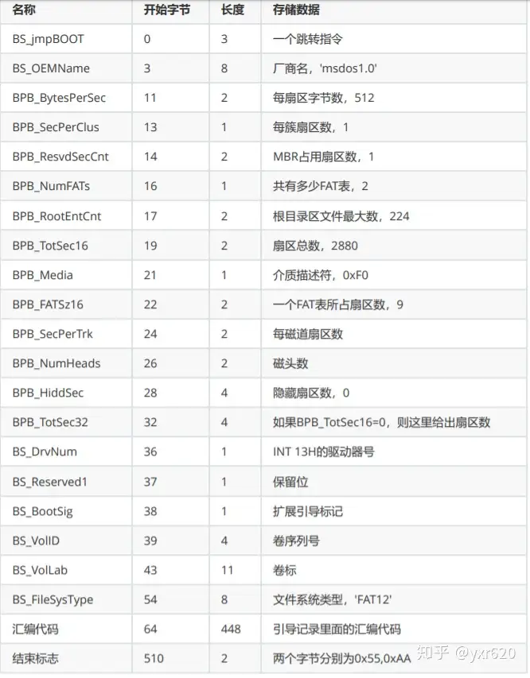
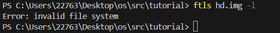
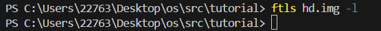
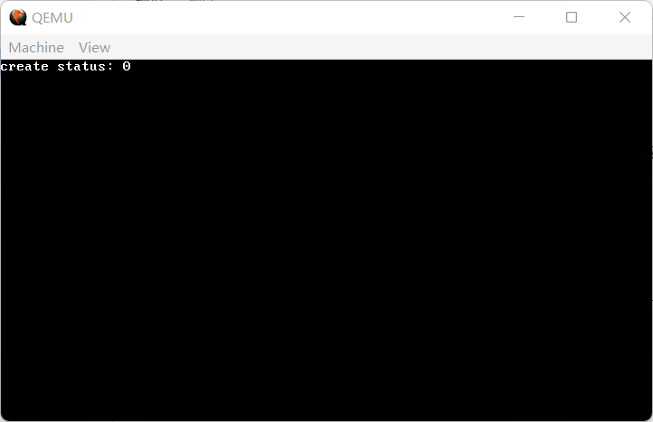
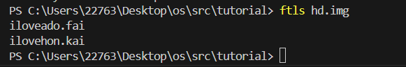

什么是 FAT16 文件系统呢？这就涉及到一段比较长的科学历史，总之，FAT16 文件系统是由微软公司自主研发的一款……（后面忘了）

FAT16 文件系统由以下几个部分组成：引导扇区、FAT 表、根目录区以及数据区。其中，引导扇区就是单独的一个扇区；FAT 表共两份，互为备份，各占 32 个扇区；根目录区占 32 个扇区；数据区占据剩余部分。FAT 表和数据区我们放在下一节来讲，本节我们只处理引导扇区和根目录区。

引导扇区的结构和前面的图 2-1 完全一致，在这里重新放一遍：



（图 18-1 FAT12/16 引导扇区结构）

它对应的代码如代码 18-1 所示：

**代码 18-1 `FAT16` 引导扇区结构（include/file.h）**
```c
typedef struct FAT_BPB_HEADER {
    unsigned char BS_jmpBoot[3];
    unsigned char BS_OEMName[8];
    unsigned short BPB_BytsPerSec;
    unsigned char BPB_SecPerClust;
    unsigned short BPB_RsvdSecCnt;
    unsigned char BPB_NumFATs;
    unsigned short BPB_RootEntCnt;
    unsigned short BPB_TotSec16;
    unsigned char BPB_Media;
    unsigned short BPB_FATSz16;
    unsigned short BPB_SecPerTrk;
    unsigned short BPB_NumHeads;
    unsigned int BPB_HiddSec;
    unsigned int BPB_TotSec32;
    unsigned char BS_DrvNum;
    unsigned char BS_Reserved1;
    unsigned char BS_BootSig;
    unsigned int BS_VolID;
    unsigned char BS_VolLab[11];
    unsigned char BS_FileSysType[8];
    unsigned char BS_BootCode[448];
    unsigned short BS_BootEndSig;
} __attribute__((packed)) bpb_hdr_t;
```

想要创建一个 FAT16 文件系统，需要把 BPB 的内容依照上面的格式填入，同时还要初始化 FAT 表——在目前的语境下，相当于向两个扇区处分别写入 4 个字节，具体是什么后面再说。

注意到，BPB 中有成员 `BPB_TotSecXX`，这就需要我们对硬盘的总扇区个数进行考察。可以通过向硬盘发送 `IDENTIFY` 命令来获取硬盘相关信息，具体步骤如下：

> 1.等待上一步可能存在的硬盘操作完成。
> 2.向0x1f6寄存器写入0x00，0x1f7寄存器写入0xec。
> 3.等待硬盘操作完成。
> 4.从0x1f0寄存器读取 512 字节的硬盘信息。
> 5.从硬盘信息中收集硬盘总扇区数。

详细代码如代码 18-2：

**代码 18-2 获取硬盘扇区数（drivers/hd.c）**
```c
static int hd_size_cache = 0;

int get_hd_sects()
{
    if (hd_size_cache) return hd_size_cache;
    while (inb(0x1f7) & 0x80); // 等硬盘不忙了再发送命令，具体意义见wait_disk_ready
    outw(0x1f6, 0x00);
    outw(0x1f7, 0xec); // IDENTIFY 命令
    wait_disk_ready();
    uint16_t *hdinfo = (uint16_t *) kmalloc(512);
    char *buffer = (char *) hdinfo;
    for (int i = 0; i < 256; i++) {
        // 每次硬盘会发送2个字节数据
        uint16_t data = inw(0x1f0);
        *((uint16_t *) buffer) = data; // 存入buf
        buffer += 2;
    }
    int sectors = ((int) hdinfo[61] << 16) + hdinfo[60];
    kfree(hd_info);
    return (hd_size_cache = sectors);
}
```

由于硬盘操作可能比较耗时，这里存了一个 `hd_size_cache`，在第一次调用后就直接引用这里面的数据而不再向硬盘发命令了。由于用到了 `kmalloc`，记得在开头添加 `#include "memory.h"`。

那么，新建 `fs` 目录，并新建 `fat16.c` 和 `file.c`，由于出现了新目录，所以贴一下新 Makefile：

**代码 18-3 新 Makefile（Makefile）**
```makefile
OBJS = out/kernel.o out/common.o out/monitor.o out/main.o out/gdtidt.o out/nasmfunc.o out/isr.o out/interrupt.o \
	 out/string.o out/timer.o out/memory.o out/mtask.o out/keyboard.o out/keymap.o out/fifo.o out/syscall.o out/syscall_impl.o \
	 out/stdio.o out/kstdio.o out/shell.o out/hd.o out/fat16.o out/cmos.o out/file.o

out/%.o : kernel/%.c
	i686-elf-gcc -c -I include -O0 -fno-builtin -fno-stack-protector -o out/$*.o kernel/$*.c

out/%.o : kernel/%.asm
	nasm -f elf -o out/$*.o kernel/$*.asm

out/%.o : lib/%.c
	i686-elf-gcc -c -I include -O0 -fno-builtin -fno-stack-protector -o out/$*.o lib/$*.c

out/%.o : lib/%.asm
	nasm -f elf -o out/$*.o lib/$*.asm

out/%.o : drivers/%.c
	i686-elf-gcc -c -I include -O0 -fno-builtin -fno-stack-protector -o out/$*.o drivers/$*.c

out/%.o : drivers/%.asm
	nasm -f elf -o out/$*.o drivers/$*.asm

out/%.o : fs/%.c
	i686-elf-gcc -c -I include -O0 -fno-builtin -fno-stack-protector -o out/$*.o fs/$*.c

out/%.o : fs/%.asm
	nasm -f elf -o out/$*.o fs/$*.asm

out/%.bin : boot/%.asm
	nasm -I boot/include -o out/$*.bin boot/$*.asm

out/kernel.bin : $(OBJS)
	i686-elf-ld -s -Ttext 0x100000 -o out/kernel.bin $(OBJS)

a.img : out/boot.bin out/loader.bin out/kernel.bin
	dd if=out/boot.bin of=a.img bs=512 count=1
	edimg imgin:a.img copy from:out/loader.bin to:@: copy from:out/kernel.bin to:@: imgout:a.img

run : a.img
	qemu-system-i386 -fda a.img -hda hd.img -boot a

clean :
	cmd /c del /f /s /q out

default : clean run
```

最下面我悄悄补了两条指令：`clean` 和 `default`，`clean` 用于把 `out` 当中的一切全部删除，`default` 则是先删后跑一步到位。

格式化文件系统也是相↑当↓公↑式→的操作，所以直接在下面贴代码了，具体细节会在代码里标注出来。

**代码 18-4 创建 FAT16 文件系统（fs/fat16.c）**
```c
#include "hd.h"
#include "memory.h"
#include "file.h"
#include "cmos.h"

// 格式化文件系统
int fat16_format_hd()
{
    static unsigned char default_boot_code[] = {
        0x8c, 0xc8, 0x8e, 0xd8, 0x8e, 0xc0, 0xb8, 0x00, 0x06, 0xbb, 0x00, 0x07, 0xb9, 0x00, 0x00, 0xba,
        0x4f, 0x18, 0xcd, 0x10, 0xb6, 0x00, 0xe8, 0x02, 0x00, 0xeb, 0xfe, 0xb8, 0x6c, 0x7c, 0x89, 0xc5,
        0xb9, 0x2a, 0x00, 0xb8, 0x01, 0x13, 0xbb, 0x07, 0x00, 0xb2, 0x00, 0xcd, 0x10, 0xc3, 0x46, 0x41,
        0x54, 0x41, 0x4c, 0x3a, 0x20, 0x6e, 0x6f, 0x74, 0x20, 0x61, 0x20, 0x62, 0x6f, 0x6f, 0x74, 0x61,
        0x62, 0x6c, 0x65, 0x20, 0x64, 0x69, 0x73, 0x6b, 0x2e, 0x20, 0x53, 0x79, 0x73, 0x74, 0x65, 0x6d,
        0x20, 0x68, 0x61, 0x6c, 0x74, 0x65, 0x64, 0x2e, 0x00, 0x00
    }; // 这段代码的意思是：输出一段信息，是用nasm写完编译的
    char *fat1 = (char *) kmalloc(512);
    hd_read(FAT1_START_LBA, 1, fat1); // 读取FAT表第一个扇区
    if (fat1[0] == 0xff) { // 如果第一个字节是0xff，那就是有文件系统
        kfree(fat1);
        return 1; // 那就没有必要格式化了
    }
    kfree(fat1);
    int sectors = get_hd_sects(); // 获取硬盘扇区大小先存着
    bpb_hdr_t hdr; // 构造一个引导扇区
    hdr.BS_jmpBoot[0] = 0xeb;
    hdr.BS_jmpBoot[1] = 0x3c; // jmp到default_boot_code
    hdr.BS_jmpBoot[2] = 0x90; // nop凑够3字节
    strcpy(hdr.BS_OEMName, "TUTORIAL"); // OEM为tutorial
    hdr.BPB_BytsPerSec = 512;
    hdr.BPB_SecPerClust = 1;
    hdr.BPB_RsvdSecCnt = 1;
    hdr.BPB_NumFATs = 2; // 总共两个FAT，这是规定
    hdr.BPB_RootEntCnt = 512; // 根目录区32个扇区，一个目录项占32字节，32*512/32=512
    if (sectors < (1 << 16) - 1) {
        hdr.BPB_TotSec16 = sectors;
        hdr.BPB_TotSec32 = 0;
    } else {
        hdr.BPB_TotSec16 = 0;
        hdr.BPB_TotSec32 = sectors;
    }
    hdr.BPB_Media = 0xf8; // 硬盘统一数据
    hdr.BPB_FATSz16 = 32; // FAT16是这样的
    hdr.BPB_SecPerTrk = 63; // 硬盘统一数据
    hdr.BPB_NumHeads = 16; // 硬盘统一数据
    hdr.BPB_HiddSec = 0;
    hdr.BS_DrvNum = 0x80; // 硬盘统一数据
    hdr.BS_Reserved1 = 0;
    hdr.BS_BootSig = 0x29;
    hdr.BS_VolID = 0;
    strcpy(hdr.BS_VolLab, "FOOLISHABBY"); // 可以随便改
    strcpy(hdr.BS_FileSysType, "FAT16   "); // 尽量别改
    memset(hdr.BS_BootCode, 0, 448);
    memcpy(hdr.BS_BootCode, default_boot_code, sizeof(default_boot_code));
    hdr.BS_BootEndSig = 0xaa55;
    hd_write(0, 1, &hdr); // 引导扇区就这样了
    char initial_fat[512] = {0xff, 0xf8, 0xff, 0xff, 0}; // 硬盘统一数据
    hd_write(FAT1_START_LBA, 1, &initial_fat); // 写入FAT1
    hd_write(FAT1_START_LBA + FAT1_SECTORS, 1, &initial_fat); // 写入FAT2
    return 0;
}
```

在上面的代码中，出现了相当多的常量，它们被统一定义在 include/file.h 中：

**代码 18-5 FAT16 文件系统相关常量（include/file.h）**
```c
#ifndef _FILE_H_
#define _FILE_H_

#include "common.h"

typedef struct FILEINFO {
    uint8_t name[8], ext[3];
    uint8_t type, reserved[10];
    uint16_t time, date, clustno;
    uint32_t size;
}  __attribute__((packed)) fileinfo_t;

typedef struct FAT_BPB_HEADER {
    unsigned char BS_jmpBoot[3];
    unsigned char BS_OEMName[8];
    unsigned short BPB_BytsPerSec;
    unsigned char BPB_SecPerClust;
    unsigned short BPB_RsvdSecCnt;
    unsigned char BPB_NumFATs;
    unsigned short BPB_RootEntCnt;
    unsigned short BPB_TotSec16;
    unsigned char BPB_Media;
    unsigned short BPB_FATSz16;
    unsigned short BPB_SecPerTrk;
    unsigned short BPB_NumHeads;
    unsigned int BPB_HiddSec;
    unsigned int BPB_TotSec32;
    unsigned char BS_DrvNum;
    unsigned char BS_Reserved1;
    unsigned char BS_BootSig;
    unsigned int BS_VolID;
    unsigned char BS_VolLab[11];
    unsigned char BS_FileSysType[8];
    unsigned char BS_BootCode[448];
    unsigned short BS_BootEndSig;
} __attribute__((packed)) bpb_hdr_t;

#define SECTOR_SIZE 512
#define FAT1_SECTORS 32
#define ROOT_DIR_SECTORS 32
#define FAT1_START_LBA 1
#define ROOT_DIR_START_LBA 65
#define DATA_START_LBA 97
#define SECTOR_CLUSTER_BALANCE (DATA_START_LBA - 2)
#define MAX_FILE_NUM 512

#endif
```

这其中有一些常量，留待下一节处理，先放着不管。

按照上面的方法，应该就可以格式化出一个 FAT16 文件系统了。下面我们进行测试。

首先，在命令行输入 `ftimgcreate hd.img -t hd -size 80`，重新创建虚拟硬盘 `hd.img`：


（图 18-2 测试步骤1）

然后，调用 `ftls hd.img -l`，确认 `hd.img` 中不存在 FAT16 文件系统：



（图 18-3 测试步骤2）

在 `main.c` 中添加 `fat16_format_hd()`，编译，运行，等待 10 秒后，再次 `ftls hd.img -l`，确认文件系统已经存在：



（图 18-4 测试步骤3）

文件系统已经成功创建，说明我们的格式化函数已经完成。接下来，就可以开始进行创建文件和打开文件的操作了。

目前而言，创建文件和打开文件都只需要操作根目录区即可完成。根目录区中，一个文件对应的信息为 32 个字节，具体代码如下所示：

**代码 18-6 根目录区中的文件信息（include/file.h）**
```c
typedef struct FILEINFO {
    uint8_t name[8], ext[3]; // 文件名，扩展名
    uint8_t type, reserved[10]; // 类型，预留
    uint16_t time, date, clustno; // 修改日期，修改时间，首簇号（下一节再讲）
    uint32_t size; // 文件大小
}  __attribute__((packed)) fileinfo_t;
```

不难发现，微软在设计时显然考虑地不多，一个文件最多只能有 8 个字符作为文件名、3 个字符作为扩展名，我们称之为 **8.3 文件名**。事实上，微软对此有解决方案，名为**长文件名**（LFN），然而实现上要考虑的细节太多，所以干脆不管。

那么，首先要考虑的就是怎样把一个文件名转化为一个合法的 8.3 文件名。在转化时，要求文件名除了大小写字母、数字外，其他字符都将被替换为下划线，小写字母将会自动转为大写字母，并且在第一个字节为 0xe5 时要自动替换为 0x05。这样的工作十分繁杂，我们选择直接修改 `myfattools` 中的 `lfn2sfn` 函数（有开源抄就是好）：

**代码 18-7 文件名转 8.3（fs/fat16.c）**
```c
// 把原文件名改编为FAT16所要求的8.3格式
int lfn2sfn(const char *lfn, char *sfn)
{
    int len = strlen(lfn), last_dot = -1;
    for (int i = len - 1; i >= 0; i--) { // 从尾到头遍历，寻找最后一个.的位置
        if (lfn[i] == '.') { // 找到了
            last_dot = i; // 最后一个.赋值一下
            break; // 跳出循环
        }
    }
    if (last_dot == -1) last_dot = len; // 没有扩展名，那就在最后虚空加个.
    if (lfn[0] == '.') return -1; // 首字符是.，不支持
    int len_name = last_dot, len_ext = len - 1 - last_dot; // 计算文件名与扩展名各自有多长
    if (len_name > 8) return -1; // 文件名长于8个字符，不支持
    if (len_ext > 3) return -1; // 扩展名长于3个字符，不支持
    // 事实上FAT对此有解决方案，称为长文件名（LFN），但实现较为复杂，暂时先不讨论
    char *name = (char *) malloc(10); // 多分配点内存
    char *ext = NULL; // ext不一定有
    if (len_ext > 0) ext = (char *) malloc(5); // 有扩展名，分配内存
    memcpy(name, lfn, len_name); // 把name从lfn中拷出来
    if (ext) memcpy(ext, lfn + last_dot + 1, len_ext); // 把ext从lfn中拷出来
    if (name[0] == 0xe5) name[0] = 0x05; // 如果第一个字节恰好是0xe5（已删除），将其更换为0x05
    for (int i = 0; i < len_name; i++) { // 处理文件名
        if (name[i] == '.') return -1; // 文件名中含有.，不支持
        if ((name[i] >= 'a' && name[i] <= 'z') || (name[i] >= 'A' && name[i] <= 'Z') || (name[i] >= '0' && name[i] <= '9')) sfn[i] = name[i]; // 数字或字母留为原样
        else sfn[i] = '_'; // 其余字符变为下划线
        if (sfn[i] >= 'a' && sfn[i] <= 'z') sfn[i] -= 0x20; // 小写变大写
    }
    for (int i = len_name; i < 8; i++) sfn[i] = ' '; // 用空格填充剩余部分
    for (int i = 0; i < len_ext; i++) { // 处理扩展名
        if ((ext[i] >= 'a' && ext[i] <= 'z') || (ext[i] >= 'A' && name[i] <= 'Z') || (ext[i] >= '0' && ext[i] <= '9')) sfn[i + 8] = ext[i]; // 数字或字母留为原样
        else sfn[i + 8] = '_'; // 其余字符变为下划线
        if (sfn[i + 8] >= 'a' && sfn[i + 8] <= 'z') sfn[i + 8] -= 0x20; // 小写变大写
    }
    if (len_ext > 0) {
        for (int i = len_ext; i < 3; i++) sfn[i + 8] = ' '; // 用空格填充剩余部分
    } else {
        for (int i = 0; i < 3; i++) sfn[i + 8] = ' '; // 用空格填充剩余部分
    }
    sfn[11] = 0; // 文件名的结尾加一个\0
    return 0; // 正常退出
}
```

具体细节详细参见注释。

在此之前，我们先来读取一下根目录区的所有文件练练手。如果你忘了根目录区的大小和起点的话，没有关系，file.h 的宏定义已经定义好了：

**代码 18-8 读取根目录所有文件 `read_dir_entries`（drivers/fat16.c）**
```c
// 读取根目录目录项
fileinfo_t *read_dir_entries(int *dir_ents)
{
    fileinfo_t *root_dir = (fileinfo_t *) kmalloc(ROOT_DIR_SECTORS * SECTOR_SIZE);
    hd_read(ROOT_DIR_START_LBA, ROOT_DIR_SECTORS, root_dir); // 将根目录的所有扇区全部读入
    int i;
    for (i = 0; i < MAX_FILE_NUM; i++) {
        if (root_dir[i].name[0] == 0) break; // 如果名字的第一个字节是0，那就说明这里没有文件
    }
    *dir_ents = i; // 将目录项个数写到指针里
    return root_dir; // 返回根目录
}
```

使用的时候，我们的调用方法和 `scanf` 很像：

**代码 18-9 `read_dir_entries` 测试（kernel/main.c）**
```c
    int entries;
    fileinfo_t *root_dir = read_dir_entries(&entries); // 用这两行替换掉 fat16_format_hd();
```

作为测试，我们来新建一个文件 `ilovehon.kai`（没什么别的意思，名字你可以随便换，但必须遵循上面提到的 8.3 文件名规则），并填充 512 个 A 和 512 个 B（同样只是测试，内容也可以随便换）：


（图 18-5 创建文件）

用 `ftcopy` 命令将文件写入虚拟硬盘 `hd.img`：


（图 18-6 写入虚拟硬盘，这里用 ftls 确认写入成功）

扩写上面的测试代码：

**代码 18-10 一个啥都没有的 `ls`（kernel/main.c）**
```c
    for (int i = 0; i < entries; i++) printk("%s\n", root_dir[i].name);
    kfree(root_dir); // 前面read的时候用的malloc分配，这里用free释放
```

为什么不需要再 `printk` 一遍 `ext` 呢？这是因为 `name` 和 `ext` 之间并没有一个明确的 \0 作为分界，printk 在输出 `name` 的同时就会输出 `ext`。

编译，运行，效果如下：


（图 18-7 输出的文件名）

注意到，将 `ilovehon.kai` 手工转化为 8.3 文件名也为 `ILOVEHONKAI`，因此可知 `read_dir_entries` 实现成功。

下面就可以正式开始创建文件的操作了。想要创建一个文件，和格式化出一个文件系统是类似的，只需要把 `fileinfo_t` 结构体当中的各个成员分别填写好就可以。

目前来看，我们总共需要填入的东西里已经有些可以完成或忽略：填入 `name` 和 `ext` 的过程已经由 `lfn2sfn` 实现了；而 `type` 只需要填上 `0x20`，`reserved`、`clustno` 和 `size` 都设置为 0 即可。那么，就只剩下 `time` 和 `date` 了。

微软对 `time` 和 `date` 的编码如下：

`time`：低 5 位为秒，中 6 位为分，高 5 位为时；

`date`：低 5 位为日，中 4 位为月，高 7 位为年。其中，年份要减去 1980，意义不明。

在上一节的基础设施建设部分，我们已经完成了 RTC，可以畅通无阻地获取目前的时间。那么，实现文件创建的基本条件已经成熟，直接开写：

**代码 18-11 创建文件（fs/fat16.c）**
```c
// 创建文件
int fat16_create_file(fileinfo_t *finfo, char *filename)
{
    if (filename[0] == 0xe5) filename[0] = 0x05; // 如上，若第一个字节为 0xe5，需要更换为 0x05
    char sfn[20] = {0};
    int ret = lfn2sfn(filename, sfn); // 将文件名转换为8.3文件名
    if (ret) return -1; // 文件名不符合8.3规范，返回
    int entries;
    fileinfo_t *root_dir = read_dir_entries(&entries); // 读取所有根目录项
    int free_slot = entries; // 默认的空闲位置是最后一个
    for (int i = 0; i < entries; i++) {
        if (!memcmp(root_dir[i].name, sfn, 8) && !memcmp(root_dir[i].ext, sfn + 8, 3)) { // 文件名和扩展名都一样
            kfree(root_dir); // 已经有了就不用创建了
            return -1;
        }
        if (root_dir[i].name[0] == 0xe5) { // 已经删除（文件名第一个字节是0xe5）
            free_slot = i; // 那就把这里当成空闲位置
            break;
        }
    }
    if (free_slot == MAX_FILE_NUM) { // 如果空闲位置已经到达根目录末尾
        kfree(root_dir); // 没地方创建也就不用创建了
        return -1;
    }
    // 开始填入fileinfo_t对应的项
    memcpy(root_dir[free_slot].name, sfn, 8); // sfn为name与ext的合体，前8个字节是name
    memcpy(root_dir[free_slot].ext, sfn + 8, 3); // 后3个字节是ext
    root_dir[free_slot].type = 0x20; // 类型为0x20（正常文件）
    root_dir[free_slot].clustno = 0; // 没有内容，所以没有簇号（同样放在下一节讲）
    root_dir[free_slot].size = 0; // 没有内容，所以大小为0
    memset(root_dir[free_slot].reserved, 0, 10); // 将预留部分全部设为0
    current_time_t ctime;
    get_current_time(&ctime); // 获取当前时间
    // 按照前文所说依次填入date和time
    root_dir[free_slot].date = ((ctime.year - 1980) << 9) | (ctime.month << 5) | ctime.day;
    root_dir[free_slot].time = (ctime.hour << 11) | (ctime.min << 5) | ctime.sec;
    if (finfo) *finfo = root_dir[free_slot]; // 创建完了不能不管，传给finfo留着
    hd_write(ROOT_DIR_START_LBA, ROOT_DIR_SECTORS, root_dir); // 将新的根目录区写回硬盘
    kfree(root_dir); // 成功完成
    return 0;
}
```

具体细节都放在代码中了，寻找空余位置和判断文件是否存在的代码反而占了大多数，真正创建文件的代码只有最后的那十几行。

最后是打开文件，我们只需要根据文件名找到对应的 `fileinfo_t` 返回就可以了。

**代码 18-12 打开文件（fs/fat16.c）**
```c
// 打开文件
int fat16_open_file(fileinfo_t *finfo, char *filename)
{
    char sfn[20] = {0};
    int ret = lfn2sfn(filename, sfn); // 将原文件名转换为8.3
    if (ret) return -1; // 转换失败，不用打开了
    int entries;
    fileinfo_t *root_dir = read_dir_entries(&entries); // 读取所有目录项
    int file_index = entries; // filename对应文件的索引
    for (int i = 0; i < entries; i++) {
        if (!memcmp(root_dir[i].name, sfn, 8) && !memcmp(root_dir[i].ext, sfn + 8, 3)) {
            file_index = i; // 找到了
            break;
        }
    }
    if (file_index < entries) { // 如果找到了……
        *finfo = root_dir[file_index]; // 那么把对应的文件存到finfo里
        kfree(root_dir);
        return 0;
    }
    else {
        finfo = NULL; // 这一句实际上是没有用的
        kfree(root_dir);
        return -1;
    }
}
```

最后就是喜闻乐见 ~~（非常傻逼）~~ 的测试环节。打开文件配合后面的读取和写入测试效果更佳，所以这里单独测试创建文件。

将刚才写的测试 `read_dir_entries` 的代码替换为：

**代码 18-13 创建文件测试（kernel/main.c）**
```c
    printk("create status: %d\n", fat16_create_file(NULL, "iloveado.fai"));
```

编译，运行，效果应如图所示：



（图 18-8 创建文件疑似成功）

在命令行中使用 `ftls` 工具，确认文件已经成功创建：



（图 18-9 创建文件成功）

好了，那么这一节作为我们实现 FAT16 的第一战，显然效果非常成功。下一节我们来实现文件的读取、写入和删除，从而为后续的包装打好地基。
